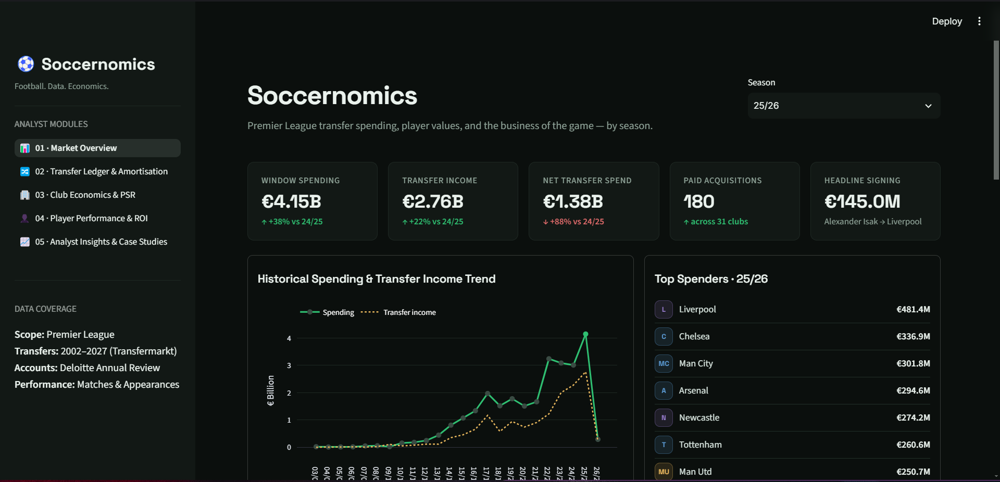
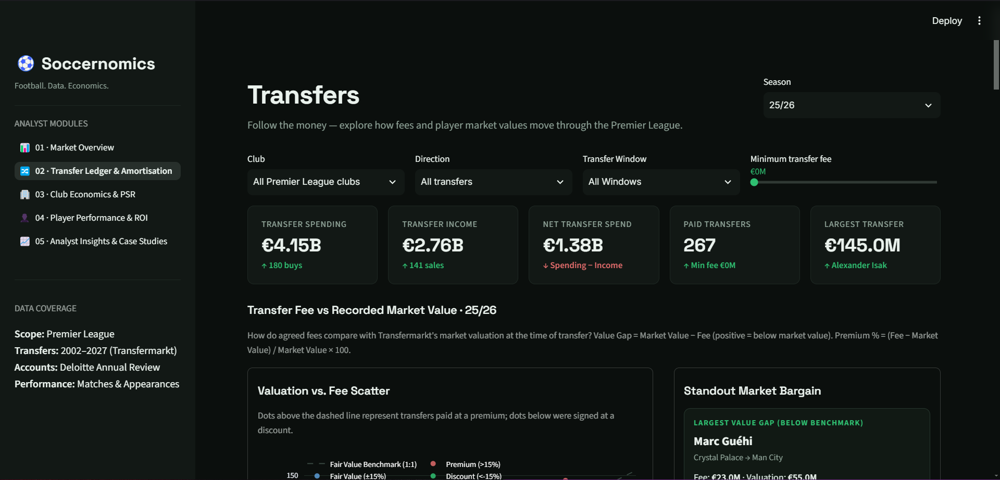
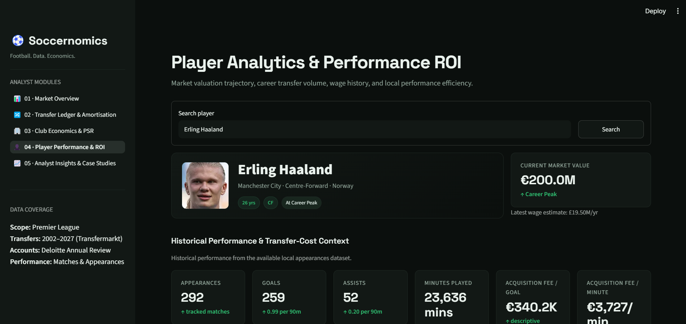

# Soccernomics

### Football Transfer Markets Through Data and Economics

Soccernomics is an interactive football analytics dashboard built with Python and Streamlit to study how money moves through the Premier League transfer market.

The project combines transfer fees, player market values, club finances, wages, and player performance data to move beyond simple transfer-fee rankings and explore the economic context behind player transactions.

---

## Preview







---

## What Problem Does It Solve?

Football transfer data usually answers simple questions:

> How much did a club spend?

Soccernomics looks at the next layer:

> Where did the money go, what value was attached to those transfers, and how does a player's financial profile relate to their performance and market value?

The project brings different datasets together into one analytical workflow covering:

- Club spending and transfer income
- Net transfer activity
- Transfer fees versus player market value
- Player valuation changes
- Club wage and financial context
- Player performance
- Individual transfer histories

---

## What We Built

### Overview

A high-level view of the Premier League transfer market across seasons, showing spending, transfer income, net spend, transfer activity and the clubs driving the market.

### Transfer Analytics

An interactive transfer-market explorer where transfers can be filtered by:

- Season
- Club
- Incoming / outgoing transfers
- Transfer window
- Minimum transfer fee

The page also examines transfer flows, spending, income and the relationship between transfer fees and player market values.

### Player Analytics

A player-level financial and performance profile combining:

- Current and peak market value
- Transfer history
- Transfer fees
- Market-value context
- Performance statistics
- Wage trajectory
- Market-value trajectory
- Acquisition cost context
- Positional profile

Current-season performance information is enriched using Gemini with web-grounded football research.

### Insights

A concise analytical layer that turns the underlying datasets into interpretable football-business observations.

---

## What We Learned From the Data

The analysis showed that transfer fees alone do not describe the economics of a football squad.

**Net spend provides a different picture from gross spending**, because clubs can offset large purchases through player sales.

**Market value provides useful context for a transfer fee**, but a difference between fee and estimated market value should not automatically be interpreted as profit or loss.

**A player's value is dynamic**, so analysing a transfer as a single transaction misses what happens to the player's valuation over time.

**Transfer expenditure is not the same as player cost**, because wages, amortisation, agent fees and other operating costs also affect the economics of a signing.

**Combining financial, transfer and performance datasets produces more meaningful questions** than analysing any one dataset independently.

---

## Key Questions

Soccernomics is built around a few simple questions:

- How much money is moving through the Premier League transfer market?
- Which clubs are the biggest spenders and sellers?
- How does transfer income compare with spending?
- How does a transfer fee compare with the player's recorded market value?
- How does a player's market value change throughout their career?
- What does a player's performance look like alongside their financial profile?

---

## Project Structure

```text
Soccernomics/
│
├── app.py
├── requirements.txt
├── README.md
│
├── pages/
│   ├── 1_Overview.py
│   ├── 2_Transfers.py
│   ├── 3_Player_Market_Value.py
│   └── 4_Insights.py
│
├── data/
│   └── raw/
│       ├── clubs.csv
│       ├── players.csv
│       ├── transfers.csv
│       ├── player_valuations.csv
│       ├── premier_league_wages_cleaned.csv
│       ├── playerstats.csv
│       └── position_heatmaps_dataset.csv
│
├── notebooks/
│   └── soccernomics_analysis.ipynb
│
├── styles.py
├── utils.py
├── gemini_utils.py
├── sofascore_heatmap.py
│
└── tests/
    └── test_utils.py